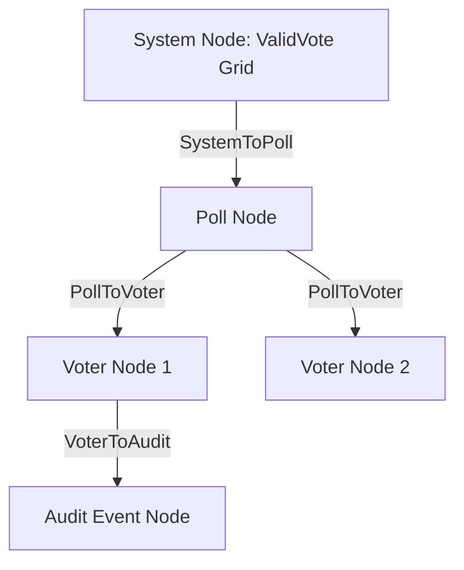

# 🗳️ ValidVote

ValidVote is a Web3-powered voting platform that couples cryptographic **Commit-Reveal schemes** on an Ethereum blockchain with an **AI-native graph intelligence layer built in Jac-lang** (Jaseci) to autonomously audit, explain, and simulate complex voting scenarios.

ValidVote bridges the gap between mathematically secure decentralized voting and accessible, human-verifiable security auditing.

---

## ✨ Features

- **🔒 Cryptographic Ballot Box**: Secure two-phase commit-reveal voting deployed via Solidity smart contracts to guarantee vote secrecy and prevent coercion.
- **🤖 Jaseci / Jac Agentic Console**: An autonomous AI verification HUD driven by native Jac graph-walkers:
  - `AuditorWalker`: Traverses the voter commitment registry, checks hash distribution entropy, and compiles natural language security risk reports.
  - `PlannerWalker`: Processes natural language voter simulations, outlines multi-step plans, and binds to database tools to dynamically populate simulated voting states.
- **🕸️ Live Traversal Network**: An interactive SVG visualization that tracks the Jaseci walker dot as it traverses System, Poll, Voter, and Audit nodes in real time.
- **📋 Real-Time SQLite Audit Engine**: A transparent, tamper-proof audit log verifying all contract transactions and server events in a side-by-side verification HUD.
- **🔑 Glassmorphic Access Control**: Hashed credential logins with random salts securely verified at the server layer.

---

## 🛠️ Technology Stack

- **Smart Contracts**: Solidity (v0.8.24), Hardhat, Hardhat Ignition, Viem
- **AI / Graph Engine**: Jac-lang, Jaseci runtime, Gemini API (`by llm()` declarations)
- **Frontend**: React, TypeScript, Vite, Tailwind CSS, RainbowKit, Wagmi, Lucide React
- **Backend API**: FastAPI (Python), SQLite (v3), Pydantic

---

## 🚀 Getting Started

### Prerequisites

- [Node.js](https://nodejs.org/) (v18+ recommended)
- [Python 3.10+](https://www.python.org/)

---

### 1. Smart Contracts Setup

Navigate to the contracts folder:
```bash
cd backend
npm install
```

Start the local Hardhat blockchain:
```bash
npx hardhat node
```

In a new terminal, deploy the Solidity contract:
```bash
npx hardhat ignition deploy ./ignition/modules/ValidVote.ts --network localhost
```

---

### 2. Backend Setup

Navigate to the backend API folder:
```bash
cd backend
pip install fastapi uvicorn pydantic
```

*(Optional: To run native Jac-lang walkers directly)*
```bash
pip install jaclang
```

Start the FastAPI backend server:
```bash
python api/server.py
```

---

### 3. Frontend Setup

Navigate to the frontend folder:
```bash
cd frontend
npm install
```

Start the Vite development web server:
```bash
npm run dev
```

Open `http://localhost:5173/` in your browser.

---

## 🤖 Jaseci AI Agent Architecture (`agent.jac`)

Our AI agents operate natively on a spatial Jaseci Graph model:



- **Graph Declarations**: Defined in `backend/api/agent.jac` using native Jac syntax.
- **Semantic Reasoning**: Walkers use Jaseci’s AI-native `by llm()` capabilities to perform direct threat analysis on the active topology.
- **Tool Binding**: Walkers dynamically query the SQLite API to fetch logs or execute simulations.
